# 🏠 HomeLab Infrastructure Guide - Complete Technical Overview

> **Purpose**: This document provides a comprehensive understanding of how this Kubernetes-based homelab infrastructure works, from bare metal to application deployment. Perfect for technical interviews and deep system understanding.

---

## 📋 Table of Contents

1. [High-Level Architecture Overview](#high-level-architecture-overview)
2. [Core Technologies Stack](#core-technologies-stack)
3. [Infrastructure Layers Explained](#infrastructure-layers-explained)
4. [Network Architecture](#network-architecture)
5. [Security & Secrets Management](#security--secrets-management)
6. [GitOps & Continuous Deployment](#gitops--continuous-deployment)
7. [Bootstrap Process](#bootstrap-process)
8. [Interview Preparation Q&A](#interview-preparation-qa)

---

## 🏗️ High-Level Architecture Overview


### What This Diagram Shows

This is a **single-node Kubernetes cluster** running on bare metal (or VM). The node serves as **both** control plane (master) and worker node, meaning it:
- **Manages** the cluster (scheduling, API, state management)
- **Runs** your application workloads (containers)

---

## 🔧 Core Technologies Stack

### 1. **Talos Linux** - The Operating System Layer

**What it is**: A Linux distribution designed specifically for running Kubernetes. Unlike Ubuntu/Debian/CentOS, Talos is "immutable" and API-driven.

**Key Characteristics**:
- 📦 **Immutable**: No SSH access, no package manager, no shell
- 🔒 **Secure by default**: Minimal attack surface, everything is API-driven
- 🎯 **Single purpose**: Only runs Kubernetes, nothing else
- ⚙️ **Declarative configuration**: Everything configured via YAML files

**Why use it?**:
- Eliminates configuration drift
- Reduces security vulnerabilities (no SSH, no unnecessary services)
- Easier to maintain (just replace nodes instead of patching)
- Perfect for GitOps workflows

**In your setup**:
```yaml
# Location: talos/talconfig.yaml
nodes:
  - hostname: "cp-01"
    ipAddress: "192.168.31.252"
    installDisk: "/dev/sdb"
    talosImageURL: factory.talos.dev/installer/[schematic-id]
    controlPlane: true
```

**Interview Tip**: Talos represents modern infrastructure thinking - treat servers like cattle, not pets. If something breaks, replace it rather than fix it.

---

### 2. **Kubernetes** - The Container Orchestration Platform

**What it is**: An open-source system for automating deployment, scaling, and management of containerized applications.

**Core Components in Your Cluster**:

#### **Control Plane Components** (Running on cp-01):

1. **API Server** (`kube-apiserver`)
   - The "front door" to your cluster
   - All commands (`kubectl`, Flux, etc.) talk to this
   - RESTful API that validates and processes requests
   - Endpoint: `https://192.168.31.240:6443`

2. **etcd** (Distributed Key-Value Store)
   - The "brain" of Kubernetes - stores all cluster state
   - Distributed database (can run across multiple control planes)
   - Critical for cluster operations - if etcd is down, cluster is down
   - Stores: pod definitions, secrets, config maps, service endpoints

3. **Controller Manager** (`kube-controller-manager`)
   - Runs "controllers" that watch cluster state and make changes
   - Examples: ensures correct number of pod replicas, creates service endpoints
   - Continuous reconciliation loop: "desired state vs actual state"

4. **Scheduler** (`kube-scheduler`)
   - Decides which node should run which pods
   - Considers: resource requirements, hardware constraints, affinity rules
   - Assigns pods to nodes but doesn't actually run them

5. **Kubelet** (Node Agent)
   - Runs on every node
   - Actually starts and manages containers
   - Reports node and pod status back to API server
   - Pulls container images, mounts volumes, monitors health

**Pod Network Configuration**:
```yaml
clusterPodNets: ["10.42.0.0/16"]    # IP range for pods
clusterSvcNets: ["10.43.0.0/16"]    # IP range for services
```

**Interview Tip**: Kubernetes is declarative - you tell it "what" you want (desired state), not "how" to do it. The controllers figure out the "how".

---

### 3. **Cilium** - Container Network Interface (CNI)

**What it is**: The networking layer that allows pods to communicate with each other and the outside world.

**Why Cilium over other CNIs?**:
- 🚀 **eBPF-based**: Uses Linux kernel's eBPF for high-performance networking
- 🔐 **Advanced security**: Network policies at L3/L4/L7 (HTTP, gRPC)
- 🕸️ **Service mesh**: Built-in load balancing and observability
- ⚡ **Performance**: Kernel-level processing = faster than iptables

**What eBPF is**:
- **Extended Berkeley Packet Filter**
- Technology that runs sandboxed programs in the Linux kernel
- No need to modify kernel source code or load kernel modules
- Used for networking, security, observability

**In your setup**:
```yaml
# Disabled built-in CNI because Cilium is installed separately
cniConfig:
  name: none
```

**What Cilium does for you**:
1. Assigns IP addresses to pods from `10.42.0.0/16`
2. Routes traffic between pods across nodes
3. Implements Kubernetes Network Policies
4. Provides load balancing for services
5. Enables encryption between pods (if configured)

**Interview Tip**: CNI is pluggable - Kubernetes doesn't care which one you use. Cilium is advanced and shows you understand modern networking.

---

### 4. **Flux CD** - GitOps Continuous Delivery

**What it is**: A tool that automatically syncs your Kubernetes cluster with a Git repository. If you change a YAML file in Git, Flux applies it to the cluster.

**GitOps Principles**:
1. **Git as Single Source of Truth**: All cluster config lives in Git
2. **Declarative**: Describe the desired state, not how to achieve it
3. **Automatic Reconciliation**: Flux continuously ensures cluster matches Git
4. **Observable**: All changes tracked via Git commits

**Flux Architecture in Your Setup**:

```mermaid
flowchart TD
    GitHub["📁 GitHub Repository<br/>─────────────────<br/>kubernetes/apps/<br/>  ├─ cert-manager/<br/>  ├─ flux-system/<br/>  ├─ kube-system/<br/>  └─ network/<br/>kubernetes/flux/cluster/ks.yaml<br/>(Entry Point)"]

    Source["🔍 Flux Source Controller<br/>─────────────────<br/>✓ Clones Git repository<br/>✓ Detects changes<br/>✓ Creates GitRepository resource"]

    Kustomize["⚙️ Flux Kustomize Controller<br/>─────────────────<br/>✓ Reads Kustomization resources<br/>✓ Decrypts secrets with SOPS<br/>✓ Builds Kubernetes manifests<br/>✓ Applies to cluster via API server"]

    GitHub -->|"Polls every 1h<br/>(or webhook)"| Source
    Source --> Kustomize

    style GitHub fill:#24292e,stroke:#fff,stroke-width:2px,color:#fff
    style Source fill:#5468ff,stroke:#fff,stroke-width:2px,color:#fff
    style Kustomize fill:#00b3b3,stroke:#fff,stroke-width:2px,color:#fff
```



**Key Flux Resources**:

1. **GitRepository**: Points to your GitHub repo
```yaml
apiVersion: source.toolkit.fluxcd.io/v1
kind: GitRepository
metadata:
  name: flux-system
spec:
  url: https://github.com/yourusername/your-repo
  interval: 1h  # Check for changes every hour
```

2. **Kustomization**: Applies configurations from Git
```yaml
apiVersion: kustomize.toolkit.fluxcd.io/v1
kind: Kustomization
metadata:
  name: cluster-apps
spec:
  path: ./kubernetes/apps
  sourceRef:
    kind: GitRepository
    name: flux-system
  interval: 1h
  prune: true  # Delete resources removed from Git
```

**Flux Workflow**:
1. You push changes to GitHub
2. Flux detects changes (polling or webhook)
3. Flux pulls new configuration
4. Flux applies changes to cluster
5. Flux monitors health of resources

**Interview Tip**: GitOps means "operations by pull request". All changes are code-reviewed, version-controlled, and auditable. This is the professional way to manage infrastructure.

---

### 5. **SOPS (Secrets Operations)** - Secrets Management

**What it is**: A tool for encrypting secrets in Git repositories using encryption keys.

**The Problem**: You want to store everything in Git (GitOps), but you can't store passwords/API keys in plain text.

**The Solution**: SOPS encrypts sensitive YAML files using AGE encryption.

**AGE Encryption**:
- **What**: Modern, simple file encryption tool (replacement for GPG)
- **How**: Uses public/private key pairs
- **Your Setup**: Private key in `age.key` (NOT committed to Git), public key used for encryption

**How it Works**:



```mermaid
flowchart TD
    Create["1️⃣ Create Secret<br/>────────────<br/>apiKey: 'sk_live_123abc...'"]:::step1

    Encrypt["2️⃣ Encrypt with SOPS<br/>────────────<br/>$ sops --encrypt --age &lt;public-key&gt; secret.yaml"]:::step2

    SaveGit["3️⃣ Save to Git<br/>────────────<br/>apiKey: ENC[AES256_GCM,data:8x7H+...,tag:...]"]:::step3

    FluxPull["4️⃣ Flux Pulls<br/>────────────<br/>Encrypted file from Git"]:::step4

    Decrypt["5️⃣ Flux Decrypts<br/>────────────<br/>Using age.key from sops-age Secret"]:::step5

    Apply["6️⃣ Apply to Cluster<br/>────────────<br/>Decrypted secret deployed"]:::step6

    Create --> Encrypt
    Encrypt --> SaveGit
    SaveGit --> FluxPull
    FluxPull --> Decrypt
    Decrypt --> Apply

    classDef step1 fill:#e8f5e9,stroke:#4caf50,stroke-width:2px
    classDef step2 fill:#fff3e0,stroke:#ff9800,stroke-width:2px
    classDef step3 fill:#e3f2fd,stroke:#2196f3,stroke-width:2px
    classDef step4 fill:#f3e5f5,stroke:#9c27b0,stroke-width:2px
    classDef step5 fill:#fce4ec,stroke:#e91e63,stroke-width:2px
    classDef step6 fill:#e0f2f1,stroke:#009688,stroke-width:2px
```

**In Your Setup**:
```yaml
# kubernetes/flux/cluster/ks.yaml
spec:
  decryption:
    provider: sops
    secretRef:
      name: sops-age  # Contains your age.key
```

**Files You'll See**:
- `*.sops.yaml` - Encrypted configuration files
- `age.key` - Your private key (NEVER commit this!)
- `cluster-secrets.sops.yaml` - Encrypted cluster-wide secrets

**Interview Tip**: SOPS allows you to practice GitOps without compromising security. All secrets are encrypted at rest in Git, but Flux can decrypt them in-cluster.

---

### 6. **Helm** - Kubernetes Package Manager

**What it is**: A tool for packaging and deploying Kubernetes applications using templates.

**Why Helm?**:
- **Reusability**: One chart, many deployments (dev, staging, prod)
- **Templating**: Dynamic values instead of hardcoded
- **Version management**: Easy upgrades/rollbacks
- **Community charts**: Thousands of pre-built apps

**Helm Concepts**:

1. **Chart**: A package of Kubernetes resources
   - Contains templates, default values, metadata
   - Example: Cilium chart, Cert-manager chart

2. **Release**: An instance of a chart running in your cluster
   - Name + chart + values = release
   - Example: "cilium" release from cilium chart

3. **Values**: Configuration options for a chart
   ```yaml
   # Customize behavior without modifying chart
   replicaCount: 3
   image:
     tag: "v1.2.3"
   ```

**Flux Helm Integration**:
```yaml
# HelmRelease tells Flux to deploy a Helm chart
apiVersion: helm.toolkit.fluxcd.io/v2
kind: HelmRelease
metadata:
  name: cilium
spec:
  chart:
    spec:
      chart: cilium
      sourceRef:
        kind: HelmRepository
        name: cilium
  values:
    autoDirectNodeRoutes: true
    bpf:
      masquerade: true
```

**Interview Tip**: Helm abstracts complexity. Instead of managing 50 YAML files for an app, you manage 1 values file.

---

### 7. **Cert-Manager** - TLS Certificate Automation

**What it is**: Automatically provisions and renews TLS/SSL certificates for your applications.

**Why it matters**:
- HTTPS is mandatory for modern web apps
- Manual certificate management is error-prone
- Certificates expire - automation prevents downtime

**How it Works**:



```mermaid
flowchart TD
    Request["1️⃣ Create Ingress/Service<br/>────────────<br/>Need cert for myapp.example.com"]:::step1

    Detect["2️⃣ Cert-Manager Detects<br/>────────────<br/>Via Certificate resource<br/>or ingress annotation"]:::step2

    Talk["3️⃣ Contact Let's Encrypt<br/>────────────<br/>Request certificate for<br/>myapp.example.com"]:::step3

    Validate["4️⃣ Domain Validation<br/>────────────<br/>DNS challenge or<br/>HTTP challenge"]:::step4

    Issue["5️⃣ Certificate Issued<br/>────────────<br/>Stored as Kubernetes Secret"]:::step5

    Use["6️⃣ Application Uses Cert<br/>────────────<br/>HTTPS enabled"]:::step6

    Renew["7️⃣ Auto-Renewal<br/>────────────<br/>Before 90-day expiration"]:::step7

    Request --> Detect
    Detect --> Talk
    Talk --> Validate
    Validate --> Issue
    Issue --> Use
    Use --> Renew
    Renew -.->|"Continuous monitoring"| Use

    classDef step1 fill:#e8f5e9,stroke:#4caf50,stroke-width:2px
    classDef step2 fill:#e3f2fd,stroke:#2196f3,stroke-width:2px
    classDef step3 fill:#fff3e0,stroke:#ff9800,stroke-width:2px
    classDef step4 fill:#f3e5f5,stroke:#9c27b0,stroke-width:2px
    classDef step5 fill:#fce4ec,stroke:#e91e63,stroke-width:2px
    classDef step6 fill:#e0f2f1,stroke:#009688,stroke-width:2px
    classDef step7 fill:#fff9c4,stroke:#fbc02d,stroke-width:2px
```

**Interview Tip**: Cert-Manager implements the ACME protocol to get free certificates from Let's Encrypt. This is industry standard for automating TLS.

---

## 🌐 Network Architecture

### IP Address Scheme

```mermaid
graph TB
    subgraph Home["🏠 HOME NETWORK: 192.168.31.0/24"]
        Router["📡 Router Gateway<br/>192.168.31.1"]
        Node["🖥️ Physical Node: cp-01<br/>192.168.31.252"]
        VIP["🎯 Cluster VIP<br/>192.168.31.240<br/>(Virtual IP for HA)"]
    end

    subgraph PodNet["📦 POD NETWORK: 10.42.0.0/16"]
        PodDesc["All Kubernetes pods get IPs<br/>from this range<br/><br/>Example: nginx-pod: 10.42.1.37"]
    end

    subgraph SvcNet["🎯 SERVICE NETWORK: 10.43.0.0/16"]
        SvcDesc["Kubernetes Services get ClusterIPs<br/>from this range<br/><br/>Example: nginx-service: 10.43.5.20"]
    end

    style Home fill:#e3f2fd,stroke:#1976d2,stroke-width:3px
    style PodNet fill:#e8f5e9,stroke:#388e3c,stroke-width:3px
    style SvcNet fill:#fff3e0,stroke:#f57c00,stroke-width:3px
    style Router fill:#90caf9,stroke:#1976d2,stroke-width:2px
    style Node fill:#90caf9,stroke:#1976d2,stroke-width:2px
    style VIP fill:#ffcc80,stroke:#f57c00,stroke-width:2px
    style PodDesc fill:#a5d6a7,stroke:#388e3c,stroke-width:2px
    style SvcDesc fill:#ffcc80,stroke:#f57c00,stroke-width:2px
```



### Virtual IP (VIP) - High Availability Concept

**What is 192.168.31.240?**
- A **floating IP** that can move between control plane nodes
- Even with only 1 node, it's configured for future HA expansion
- If you add more control planes, they'll share this VIP
- Clients always connect to the VIP, not individual nodes

**Why use VIP?**
- **Fault tolerance**: If one control plane dies, VIP moves to another
- **Transparent failover**: Clients don't need to update endpoints
- **Load balancing**: Distributes API server load

### DNS Configuration

```yaml
# talos/patches/global/machine-network.yaml
machine:
  network:
    nameservers:
      - 1.1.1.1  # Cloudflare DNS (primary)
      - 1.0.0.1  # Cloudflare DNS (secondary)
```

**Why Cloudflare DNS?**
- Fast, reliable, privacy-focused
- Anycast network (automatically routes to nearest server)
- DNSSEC validation

### Network Flow Examples

#### Example 1: Pod-to-Pod Communication

```mermaid
flowchart TD
    PodA["📦 Pod A<br/>10.42.1.5<br/>──────────<br/>Wants to talk to Pod B"]:::podA

    Cilium["⚡ Cilium eBPF<br/>──────────<br/>Intercepts packet at kernel level<br/><br/>✓ Checks Network Policies<br/>✓ Applies load balancing if needed<br/>✓ Routes directly to Pod B"]:::cilium

    PodB["📦 Pod B<br/>10.42.1.8<br/>──────────<br/>Receives packet"]:::podB

    PodA -->|"Packet"| Cilium
    Cilium -->|"Routed"| PodB

    classDef podA fill:#e3f2fd,stroke:#1976d2,stroke-width:2px
    classDef cilium fill:#f3e5f5,stroke:#7b1fa2,stroke-width:3px
    classDef podB fill:#e8f5e9,stroke:#388e3c,stroke-width:2px
```



#### Example 2: External Access via Cloudflare Tunnel

```mermaid
flowchart TD
    User["👤 User<br/>Visits https://myapp.yourdomain.com"]:::user

    CF["☁️ Cloudflare CDN<br/>──────────<br/>✓ DDoS protection applied<br/>✓ SSL/TLS termination (or passthrough)<br/>✓ Routes to Cloudflare Tunnel"]:::cloudflare

    Tunnel["🔒 Cloudflared Daemon<br/>(Running in cluster)<br/>──────────<br/>✓ Maintains persistent connection<br/>✓ No inbound firewall ports needed<br/>✓ Forwards to internal service"]:::tunnel

    Service["🎯 Kubernetes Service<br/>ClusterIP: 10.43.x.x"]:::service

    Pod["📦 Application Pod<br/>PodIP: 10.42.x.x"]:::pod

    User -->|"HTTPS Request"| CF
    CF -->|"Encrypted Tunnel<br/>(HTTPS)"| Tunnel
    Tunnel -->|"Internal"| Service
    Service -->|"Routes to"| Pod

    classDef user fill:#fff9c4,stroke:#f57f17,stroke-width:2px
    classDef cloudflare fill:#f57c00,stroke:#e65100,stroke-width:3px,color:#fff
    classDef tunnel fill:#7b1fa2,stroke:#4a148c,stroke-width:2px,color:#fff
    classDef service fill:#1976d2,stroke:#0d47a1,stroke-width:2px,color:#fff
    classDef pod fill:#388e3c,stroke:#1b5e20,stroke-width:2px,color:#fff
```



**Cloudflare Tunnel Benefits**:
- ✅ No need to expose ports on home router
- ✅ Free DDoS protection
- ✅ No dynamic DNS needed
- ✅ Works behind CGNAT (Carrier-Grade NAT)

---

## 🔐 Security & Secrets Management

### Security Layers

```mermaid
flowchart TD
    Layer1["🏗️ Layer 1: Physical/Network Security<br/>─────────────────────<br/>✓ Home network isolation<br/>✓ Firewall rules on router<br/>✓ VPN/Cloudflare Tunnel for external access"]:::layer1

    Layer2["🐧 Layer 2: OS Security (Talos Linux)<br/>─────────────────────<br/>✓ No SSH access (API-only)<br/>✓ Immutable filesystem<br/>✓ Minimal attack surface<br/>✓ Secure boot capable"]:::layer2

    Layer3["☸️ Layer 3: Kubernetes RBAC<br/>─────────────────────<br/>✓ Service accounts with minimal permissions<br/>✓ Role-Based Access Control<br/>✓ Pod Security Standards"]:::layer3

    Layer4["🕸️ Layer 4: Network Policies (Cilium)<br/>─────────────────────<br/>✓ Pod-to-pod communication rules<br/>✓ Namespace isolation<br/>✓ L7 (HTTP) filtering"]:::layer4

    Layer5["🔐 Layer 5: Secrets Encryption<br/>─────────────────────<br/>✓ SOPS + AGE for secrets at rest (in Git)<br/>✓ Kubernetes secrets encrypted in etcd<br/>✓ TLS for data in transit"]:::layer5

    Layer1 --> Layer2
    Layer2 --> Layer3
    Layer3 --> Layer4
    Layer4 --> Layer5

    classDef layer1 fill:#ffebee,stroke:#c62828,stroke-width:3px
    classDef layer2 fill:#fff3e0,stroke:#e65100,stroke-width:3px
    classDef layer3 fill:#e8f5e9,stroke:#2e7d32,stroke-width:3px
    classDef layer4 fill:#e3f2fd,stroke:#1565c0,stroke-width:3px
    classDef layer5 fill:#f3e5f5,stroke:#6a1b9a,stroke-width:3px
```



### Secrets Management Workflow

**Your Secrets**:
1. `age.key` - AGE private key for SOPS decryption
2. `cloudflare-tunnel.json` - Cloudflare tunnel credentials
3. `github-deploy.key` - SSH key for Git operations
4. `github-push-token.txt` - GitHub token for automation
5. `talsecret.sops.yaml` - Encrypted Talos secrets
6. `cluster-secrets.sops.yaml` - Encrypted cluster-wide secrets

**Best Practices Implemented**:
1. ✅ Secrets encrypted before committing to Git
2. ✅ Private keys never committed (in .gitignore)
3. ✅ Least privilege (each component gets only needed secrets)
4. ✅ Rotation capability (can update encrypted secrets)
5. ✅ Audit trail (Git history shows when secrets changed)

---

## 🔄 GitOps & Continuous Deployment

### The GitOps Loop

```mermaid
flowchart TD
    Dev["👨‍💻 1. Developer Makes Change<br/>────────────<br/>✓ Edit kubernetes/apps/myapp/helmrelease.yaml<br/>✓ Change image: v1.2.3 → v1.2.4<br/>✓ git commit && git push"]:::step1

    GitHub["📁 2. GitHub Stores Change<br/>────────────<br/>✓ Commit SHA: abc123<br/>✓ Trigger: Push event"]:::step2

    FluxDetect["🔍 3. Flux Detects Change<br/>────────────<br/>✓ Source Controller pulls new commit<br/>✓ Compares with current cluster state"]:::step3

    FluxApply["⚙️ 4. Flux Applies Change<br/>────────────<br/>✓ Kustomize Controller builds manifests<br/>✓ Helm Controller updates release<br/>✓ API Server receives updated resources"]:::step4

    K8sReconcile["☸️ 5. Kubernetes Reconciles<br/>────────────<br/>✓ Deployment controller creates new pod<br/>✓ Pulls new image: v1.2.4<br/>✓ Waits for health checks<br/>✓ Terminates old pod"]:::step5

    FluxMonitor["📊 6. Flux Monitors Health<br/>────────────<br/>✓ Checks pod status<br/>✓ Reports success/failure<br/>✓ Can auto-rollback on failure"]:::step6

    Dev --> GitHub
    GitHub --> FluxDetect
    FluxDetect --> FluxApply
    FluxApply --> K8sReconcile
    K8sReconcile --> FluxMonitor
    FluxMonitor -.->|"Continuous<br/>Monitoring"| FluxDetect

    classDef step1 fill:#e8f5e9,stroke:#4caf50,stroke-width:3px
    classDef step2 fill:#fff3e0,stroke:#ff9800,stroke-width:3px
    classDef step3 fill:#e3f2fd,stroke:#2196f3,stroke-width:3px
    classDef step4 fill:#f3e5f5,stroke:#9c27b0,stroke-width:3px
    classDef step5 fill:#fce4ec,stroke:#e91e63,stroke-width:3px
    classDef step6 fill:#e0f2f1,stroke:#009688,stroke-width:3px
```



### Flux Directory Structure

```
kubernetes/
├── flux/
│   ├── cluster/
│   │   └── ks.yaml              ← Entry point (applied first)
│   └── meta/
│       └── kustomization.yaml   ← Flux config resources
│
└── apps/                        ← All applications
    ├── cert-manager/
    │   ├── kustomization.yaml
    │   └── cert-manager/
    │       ├── ks.yaml          ← Kustomization resource
    │       └── app/
    │           ├── helmrelease.yaml
    │           ├── secret.sops.yaml
    │           └── kustomization.yaml
    │
    ├── kube-system/
    │   ├── cilium/
    │   ├── coredns/
    │   └── metrics-server/
    │
    └── network/
        ├── cloudflare-dns/
        └── cloudflare-tunnel/
```

**How Flux Discovers Apps**:
1. `flux/cluster/ks.yaml` points to `kubernetes/apps/`
2. Each app directory has `ks.yaml` (Kustomization)
3. Each `ks.yaml` points to `app/` subdirectory
4. `app/` contains actual Kubernetes resources

**Dependency Management**:
```yaml
# Apps can depend on each other
spec:
  dependsOn:
    - name: cilium
      namespace: kube-system
```
This ensures Cilium is deployed before dependent apps.

---

## 🚀 Bootstrap Process

### Complete Deployment Flow

```mermaid
flowchart TD
    Phase0["💻 PHASE 0: Preparation<br/>(Workstation)<br/>────────────<br/>✓ Install mise, task, kubectl, talosctl<br/>✓ Clone repository<br/>✓ Generate AGE key for SOPS<br/>✓ Configure Cloudflare (API token, domain)<br/>✓ Flash Talos ISO to USB"]:::phase0

    Phase1["🐧 PHASE 1: Talos Installation<br/>────────────<br/>✓ Boot node from Talos ISO<br/>✓ Generate Talos configs: task talos:generate<br/>✓ Apply configs to node: task talos:apply<br/>✓ Bootstrap etcd: task talos:bootstrap<br/>✓ Generate kubeconfig: task talos:kubeconfig<br/><br/>✅ Result: Talos running, Kubernetes NOT running yet"]:::phase1

    Phase2["☸️ PHASE 2: Kubernetes Bootstrap<br/>(Helmfile)<br/>────────────<br/>✓ Deploy Cilium (CNI) - pods can now communicate<br/>✓ Deploy CoreDNS - pods can resolve names<br/>✓ Deploy Cert-Manager - certificates automated<br/>✓ Deploy Flux Operator - installs Flux CRDs<br/>✓ Deploy Flux Instance - starts GitOps controller<br/><br/>✅ Result: Kubernetes running with core components"]:::phase2

    Phase3["🔄 PHASE 3: GitOps Activation<br/>────────────<br/>✓ Flux connects to GitHub repository<br/>✓ Flux reads kubernetes/flux/cluster/ks.yaml<br/>✓ Flux discovers all app Kustomizations<br/>✓ Flux applies apps in dependency order<br/>✓ Flux enters continuous reconciliation mode<br/><br/>✅ Result: All applications deployed and managed by Git"]:::phase3

    Phase0 --> Phase1
    Phase1 --> Phase2
    Phase2 --> Phase3

    classDef phase0 fill:#e8eaf6,stroke:#3f51b5,stroke-width:3px
    classDef phase1 fill:#fff3e0,stroke:#ff9800,stroke-width:3px
    classDef phase2 fill:#e8f5e9,stroke:#4caf50,stroke-width:3px
    classDef phase3 fill:#e3f2fd,stroke:#2196f3,stroke-width:3px
```



### Key Bootstrap Commands

**Talos Tasks** (defined in `.taskfiles/talos/Taskfile.yaml`):
```bash
# Generate Talos machine configs from talconfig.yaml
task talos:generate

# Apply config to node (installs Talos)
task talos:apply

# Initialize etcd (first control plane only)
task talos:bootstrap

# Get kubeconfig for kubectl access
task talos:kubeconfig
```

**Bootstrap Tasks** (defined in `.taskfiles/bootstrap/Taskfile.yaml`):
```bash
# Deploy core components with Helmfile
task bootstrap:flux

# Create SOPS secret in cluster
task bootstrap:sops-secret
```

**What Helmfile Does** (`bootstrap/helmfile.yaml`):
1. Deploys releases in order (needs: dependencies)
2. Uses OCI registries (oci://ghcr.io/...)
3. Applies custom values from `values.yaml.gotmpl`
4. Waits for each release to be ready

---

## 📚 Interview Preparation Q&A

### Architecture Questions

**Q: Why use Kubernetes for a homelab?**
A: Kubernetes provides:
- Consistent deployment model (same as production)
- Self-healing (automatically restarts failed containers)
- Declarative configuration (desired state management)
- Scalability (can grow from 1 to 100s of nodes)
- Industry-standard skills development
- Rich ecosystem (Helm charts, operators, tools)

**Q: Why single control plane instead of HA?**
A:
- Cost-effective for homelab (1 node vs 3 minimum)
- Acceptable downtime for non-production
- Can be expanded later (VIP already configured)
- Demonstrates understanding of HA concepts without cost

**Q: How does the cluster survive node failure?**
A: It doesn't (single node). But:
- Talos makes recovery fast (immutable OS)
- GitOps means all config in Git (easy restore)
- etcd backups could be configured
- For production, I'd use 3+ control planes with HA

**Q: What happens if etcd gets corrupted?**
A:
1. Cluster is down (etcd is critical)
2. Restore from backup (if configured)
3. Or rebuild cluster (Flux reapplies everything from Git)
4. Data in persistent volumes may survive

### Networking Questions

**Q: Explain pod-to-pod communication.**
A:
1. Each pod gets unique IP from `10.42.0.0/16`
2. Cilium (CNI) creates virtual network interfaces
3. eBPF programs in kernel route packets
4. No NAT needed between pods (flat network)
5. Network policies can restrict communication

**Q: How do services work?**
A:
1. Service gets ClusterIP from `10.43.0.0/16`
2. Service selector matches pod labels
3. Endpoints controller creates endpoint list
4. kube-proxy (or Cilium) updates routing rules
5. Traffic to ClusterIP load-balanced to pods

**Q: Why use Cloudflare Tunnel instead of port forwarding?**
A:
- **Security**: No exposed ports on home router
- **DDoS Protection**: Cloudflare absorbs attacks
- **CGNAT**: Works behind carrier NAT
- **SSL**: Cloudflare handles certificates
- **DNS**: Automatic failover if IP changes

**Q: What is eBPF and why does it matter?**
A:
- Runs programs in Linux kernel without kernel modules
- Cilium uses it for fast packet processing
- 10x+ faster than iptables (legacy)
- Enables advanced features (L7 policies, monitoring)
- Future of Linux networking and security

### GitOps Questions

**Q: What happens if someone makes a manual change to the cluster?**
A: Flux will revert it within 1 hour (reconciliation interval). This enforces "Git as source of truth".

**Q: How do you handle emergency hotfixes?**
A:
1. Make change in Git (even if rushed)
2. Use `flux reconcile` to apply immediately
3. Or temporarily increase sync frequency
4. Never bypass Git (breaks audit trail)

**Q: How do secrets get into the cluster securely?**
A:
1. Secrets encrypted with SOPS + AGE
2. Encrypted files committed to Git (safe)
3. AGE private key stored in cluster as Secret
4. Flux decrypts on-the-fly during apply
5. Decrypted secrets never touch Git

**Q: What if the Git repository is compromised?**
A:
- Attacker sees encrypted secrets (useless without AGE key)
- Can see infrastructure layout (security through obscurity fails anyway)
- Can't decrypt `*.sops.yaml` files
- AGE key is separate (not in Git)

### Operational Questions

**Q: How do you update an application?**
A:
1. Edit `helmrelease.yaml` (change image tag)
2. Commit and push to Git
3. Flux detects change (polling or webhook)
4. Flux updates HelmRelease
5. Kubernetes rolls out new pods

**Q: How do you rollback a bad deployment?**
A:
1. Revert Git commit (`git revert`)
2. Push to Git
3. Flux applies old configuration
4. Or manually: `helm rollback <release>`

**Q: How do you debug a failing pod?**
A:
```bash
# Check pod status
kubectl get pods -n namespace

# View logs
kubectl logs pod-name -n namespace

# Describe pod (events, state)
kubectl describe pod pod-name -n namespace

# Get shell in running pod
kubectl exec -it pod-name -n namespace -- /bin/sh

# Check Flux status
flux get kustomizations
flux get helmreleases
```

**Q: What monitoring do you have?**
A:
- Prometheus deployed (`prometheus-community`)
- Metrics Server for resource usage
- Flux has built-in status reporting
- Could add Grafana for dashboards
- Could add Alertmanager for notifications

### Talos-Specific Questions

**Q: How do you access Talos nodes without SSH?**
A:
```bash
# Using talosctl CLI
talosctl -n 192.168.31.252 dashboard
talosctl -n 192.168.31.252 logs kubelet
talosctl -n 192.168.31.252 get members
```

**Q: How do you upgrade Talos?**
A:
1. Update `talosVersion` in `talconfig.yaml`
2. Generate new configs: `task talos:generate`
3. Apply upgrade: `task talos:upgrade`
4. Talos downloads new image and reboots
5. Cluster comes back online (workloads persist)

**Q: What happens if disk fails?**
A:
- OS is lost (but it's immutable, so no unique state)
- Reinstall Talos from ISO
- Apply same configuration
- Node rejoins cluster
- Workloads rescheduled from other nodes (in HA setup)

### Advanced Concepts

**Q: What is reconciliation?**
A: Continuous loop comparing desired state (Git) with actual state (cluster) and making changes to align them. This is the heart of Kubernetes and GitOps.

**Q: How does Flux handle large repositories?**
A:
- Clones only needed branches
- Can use Git submodules
- Can filter paths (only sync certain directories)
- Can use shallow clones

**Q: What is Kustomize?**
A: Tool for customizing Kubernetes YAML without templates. Uses overlays to modify base configurations. Flux uses it internally.

**Q: Could this setup run in production?**
A: With modifications:
- ✅ Architecture is sound
- ⚠️ Need 3+ control planes for HA
- ⚠️ Need monitoring and alerting
- ⚠️ Need backup strategy (etcd, persistent data)
- ⚠️ Need proper disaster recovery plan
- ⚠️ Need security hardening (network policies, RBAC)

---

## 🎯 Key Takeaways for Interview

### What This Project Demonstrates

1. **Modern Infrastructure Practices**
   - Infrastructure as Code (IaC)
   - GitOps for operational workflows
   - Immutable infrastructure (Talos)
   - Declarative configuration

2. **Technical Depth**
   - Understanding of Kubernetes architecture
   - Container networking (Cilium, eBPF)
   - Secrets management (SOPS, AGE)
   - Certificate automation (Cert-Manager)
   - Continuous delivery (Flux)

3. **Problem-Solving Skills**
   - Cloudflare Tunnel for secure external access
   - SOPS for secrets in Git
   - Helm for application packaging
   - Automation with Task runner

4. **Production-Ready Patterns**
   - GitOps workflow (industry standard)
   - Monitoring readiness (Prometheus)
   - Security layers (defense in depth)
   - Disaster recovery capability (Git as source of truth)

### Your Story

**"I built a homelab Kubernetes cluster to learn modern infrastructure practices used in production environments. I chose:**

- **Talos Linux** for an immutable, API-driven OS that's more secure and maintainable
- **Cilium** for eBPF-based networking, giving me experience with cutting-edge technology
- **Flux CD** for GitOps, ensuring all changes are version-controlled and auditable
- **SOPS** for secrets management, following security best practices
- **Cloudflare Tunnel** for secure external access without exposing my home network

**The cluster runs several applications including monitoring (Prometheus), DNS (CoreDNS), and certificate management (Cert-Manager). Everything is managed through Git - I can tear down and rebuild the entire cluster from scratch using my repository. This gave me hands-on experience with the same tools and patterns used by major tech companies."**

---

## 📖 Further Study Topics

### Week 1-2: Kubernetes Fundamentals
- [ ] Pods, Deployments, Services, Ingress
- [ ] ConfigMaps and Secrets
- [ ] Namespaces and RBAC
- [ ] Resource limits and requests
- [ ] Health checks (liveness, readiness, startup probes)

### Week 3-4: Networking Deep Dive
- [ ] CNI plugins comparison
- [ ] Service types (ClusterIP, NodePort, LoadBalancer)
- [ ] Network Policies
- [ ] Ingress controllers
- [ ] DNS resolution in Kubernetes

### Week 5-6: Storage and Persistence
- [ ] PersistentVolumes and PersistentVolumeClaims
- [ ] StorageClasses
- [ ] StatefulSets
- [ ] Backup strategies

### Week 7-8: Advanced Topics
- [ ] Custom Resource Definitions (CRDs)
- [ ] Operators
- [ ] Admission controllers
- [ ] Pod Security Standards
- [ ] Resource quotas and limit ranges

### Week 9-10: Observability
- [ ] Prometheus query language (PromQL)
- [ ] Grafana dashboards
- [ ] Log aggregation (Loki, ELK)
- [ ] Distributed tracing (Jaeger)

### Week 11-12: Production Readiness
- [ ] High availability patterns
- [ ] Disaster recovery
- [ ] Cluster upgrades
- [ ] Security scanning (Trivy, Falco)
- [ ] Cost optimization

---

## 🔗 Useful Resources

### Official Documentation
- [Kubernetes Docs](https://kubernetes.io/docs/)
- [Talos Linux Docs](https://www.talos.dev/)
- [Flux CD Docs](https://fluxcd.io/docs/)
- [Cilium Docs](https://docs.cilium.io/)

### Learning Platforms
- [Kubernetes By Example](https://kubernetesbyexample.com/)
- [CNCF Landscape](https://landscape.cncf.io/)
- [KillerCoda Interactive Labs](https://killercoda.com/)

### Community
- [Kubernetes Slack](https://slack.k8s.io/)
- [r/kubernetes](https://reddit.com/r/kubernetes)
- [CNCF YouTube](https://youtube.com/@cncf)

---

## 📝 Lab Exercises to Master This System

### Exercise 1: Deploy a New Application
**Goal**: Deploy nginx with custom configuration

1. Create directory: `kubernetes/apps/default/nginx/`
2. Create `ks.yaml`, `helmrelease.yaml`, `kustomization.yaml`
3. Commit and push
4. Watch Flux deploy it: `flux get kustomizations -w`
5. Access it: `kubectl port-forward svc/nginx 8080:80`

### Exercise 2: Create and Use a Secret
**Goal**: Deploy app with encrypted database password

1. Create secret file: `secret.yaml`
2. Encrypt it: `sops --encrypt --age $(cat age.key |grep public) secret.yaml > secret.sops.yaml`
3. Commit encrypted file
4. Create app that references secret
5. Verify: `kubectl get secret -n namespace`

### Exercise 3: Troubleshoot a Failing Pod
**Goal**: Diagnose and fix a crashlooping pod

1. Deploy intentionally broken app (wrong image tag)
2. Check status: `kubectl get pods`
3. View logs: `kubectl logs pod-name`
4. Describe pod: `kubectl describe pod pod-name`
5. Fix in Git and watch recovery

### Exercise 4: Update Cluster Component
**Goal**: Upgrade Cilium

1. Edit `kubernetes/apps/kube-system/cilium/app/helmrelease.yaml`
2. Change version: `1.18.1` → `1.18.2`
3. Commit and push
4. Watch Flux upgrade: `flux get helmreleases -n kube-system -w`
5. Verify: `cilium version`

### Exercise 5: Simulate Disaster Recovery
**Goal**: Rebuild cluster from Git

1. Delete a namespace: `kubectl delete ns default`
2. Force Flux reconciliation: `flux reconcile ks cluster-apps`
3. Watch namespace and apps recreate
4. Verify all apps running

---

## 🚀 Next Steps

1. **Master the Basics** (Days 1-7)
   - Read this document thoroughly
   - Explore the codebase (`kubernetes/`, `talos/`)
   - Run commands: `kubectl get all -A`, `flux get all -A`

2. **Hands-On Practice** (Days 8-14)
   - Complete Lab Exercises 1-3
   - Break things intentionally and fix them
   - Document your findings

3. **Deep Dives** (Days 15-30)
   - Study Cilium networking in detail
   - Understand Flux reconciliation loops
   - Learn Helm chart creation

4. **Interview Prep** (Days 30-40)
   - Practice explaining architecture
   - Prepare diagrams on whiteboard
   - Rehearse common questions
   - Do mock interviews

5. **Continuous Improvement**
   - Add monitoring dashboards (Grafana)
   - Implement backups (Velero)
   - Add more applications
   - Document your learnings

---

## 🎓 Closing Thoughts

**This homelab is a production-grade setup scaled down**. The patterns, tools, and workflows are identical to what major companies use to run Kubernetes at scale.

**Key differentiators in interviews**:
- You understand the full stack (OS to application)
- You've implemented GitOps (many talk about it, few do it)
- You handle secrets properly (security-conscious)
- You can explain trade-offs (single node vs HA)

**Remember**: The fact you can rebuild this entire cluster from a Git repository is **powerful**. Many production teams can't do this. You've implemented disaster recovery by design.

**Good luck!** 🚀

---

*Last Updated: October 2025*
*Author: Based on Lamprinakis HomeLab Infrastructure*
