# 🔐 Complete SOPS Guide - How Secrets Management Works in Your Homelab

> **Purpose**: This document explains in detail how SOPS (Secrets Operations) works in your homelab, covering all files, workflows, and encryption processes.

---

## 📋 Table of Contents

1. [Overview - What is SOPS?](#overview---what-is-sops)
2. [All SOPS-Related Files](#all-sops-related-files)
3. [How Encryption Works](#how-encryption-works)
4. [How Decryption Works](#how-decryption-works)
5. [Complete Workflow](#complete-workflow)
6. [File-by-File Explanation](#file-by-file-explanation)
7. [Interview Questions & Answers](#interview-questions--answers)

---

## 🎯 Overview - What is SOPS?

**SOPS** (Secrets Operations) is a tool that encrypts files using various encryption methods (AGE, GPG, AWS KMS, etc.). In your homelab, you use **AGE encryption** to protect sensitive data like API keys, passwords, and certificates.

### Why SOPS?

- ✅ Store secrets safely in Git (encrypted)
- ✅ Version control for secrets (track changes)
- ✅ GitOps-compatible (Flux can decrypt automatically)
- ✅ Selective encryption (only encrypt sensitive fields)
- ✅ Easy key rotation

---

## 📁 All SOPS-Related Files

### Configuration Files

1. **`.sops.yaml`** - SOPS configuration file (root directory)
2. **`age.key`** - Your private AGE key (NEVER commit to Git)

### Encrypted Secret Files

3. **`kubernetes/components/common/sops/sops-age.sops.yaml`** - Encrypted AGE key for cluster
4. **`kubernetes/components/common/sops/cluster-secrets.sops.yaml`** - Encrypted cluster-wide secrets
5. **`talos/talsecret.sops.yaml`** - Encrypted Talos cluster secrets
6. **`kubernetes/apps/cert-manager/cert-manager/app/secret.sops.yaml`** - Cert-Manager API token
7. **`kubernetes/apps/network/cloudflare-dns/app/secret.sops.yaml`** - Cloudflare DNS API credentials
8. **`kubernetes/apps/network/cloudflare-tunnel/app/secret.sops.yaml`** - Cloudflare Tunnel credentials
9. **`kubernetes/apps/flux-system/flux-instance/app/secret.sops.yaml`** - Flux GitHub credentials

### Flux Configuration Files (Reference sops-age)

10. **`kubernetes/flux/cluster/ks.yaml`** - Tells Flux to use SOPS for decryption
11. **`kubernetes/apps/*/ks.yaml`** - Each app's Kustomization references SOPS

---

## 🔒 How Encryption Works

```mermaid
flowchart TD
    Create["1️⃣ Create Plain Secret<br/>────────────<br/>apiKey: 'my-secret-token'<br/>password: 'supersecret'"]:::step1

    Config["2️⃣ .sops.yaml Rules<br/>────────────<br/>• Match file path<br/>• Identify fields to encrypt<br/>• Use AGE public key"]:::step2

    Encrypt["3️⃣ SOPS Encryption<br/>────────────<br/>$ sops --encrypt secret.yaml<br/>Uses AGE public key"]:::step3

    Encrypted["4️⃣ Encrypted File<br/>────────────<br/>apiKey: ENC[AES256_GCM,data:...]<br/>password: ENC[AES256_GCM,data:...]"]:::step4

    Commit["5️⃣ Commit to Git<br/>────────────<br/>$ git add secret.sops.yaml<br/>$ git commit -m 'Add secret'<br/>$ git push"]:::step5

    Create --> Config
    Config --> Encrypt
    Encrypt --> Encrypted
    Encrypted --> Commit

    classDef step1 fill:#e8f5e9,stroke:#4caf50,stroke-width:2px
    classDef step2 fill:#e3f2fd,stroke:#2196f3,stroke-width:2px
    classDef step3 fill:#fff3e0,stroke:#ff9800,stroke-width:2px
    classDef step4 fill:#f3e5f5,stroke:#9c27b0,stroke-width:2px
    classDef step5 fill:#fce4ec,stroke:#e91e63,stroke-width:2px
```



### Encryption Process Details

1. **You create a plain YAML secret file**:
   ```yaml
   apiVersion: v1
   kind: Secret
   metadata:
     name: my-secret
   stringData:
     apiKey: "my-secret-token-123"
     password: "supersecretpassword"
   ```

2. **SOPS reads `.sops.yaml` configuration**:
   ```yaml
   creation_rules:
     - path_regex: kubernetes/.*\.sops\.ya?ml
       encrypted_regex: "^(data|stringData)$"
       age: "age1rfhjffgpnm7tcgcaj4ecq4y8t6j5dp4dcpseuqg66tj707wm49vsjffx8x"
   ```

3. **SOPS encrypts the file using your AGE public key**:
   ```bash
   sops --encrypt --age age1rfhjffgpnm7tcgcaj4ecq4y8t6j5dp4dcpseuqg66tj707wm49vsjffx8x secret.yaml > secret.sops.yaml
   ```

4. **Result - Encrypted file**:
   ```yaml
   apiVersion: v1
   kind: Secret
   metadata:
     name: my-secret
   stringData:
     apiKey: ENC[AES256_GCM,data:8x7H+...,iv:...,tag:...,type:str]
     password: ENC[AES256_GCM,data:9y8I+...,iv:...,tag:...,type:str]
   sops:
     age:
       - recipient: age1rfhjffgpnm7tcgcaj4ecq4y8t6j5dp4dcpseuqg66tj707wm49vsjffx8x
         enc: |
           -----BEGIN AGE ENCRYPTED FILE-----
           ...encrypted data...
           -----END AGE ENCRYPTED FILE-----
     lastmodified: "2025-08-29T18:35:36Z"
     mac: ENC[AES256_GCM,data:...,iv:...,tag:...,type:str]
   ```

5. **The encrypted file is safe to commit to Git**.

---

## 🔓 How Decryption Works

```mermaid
flowchart TD
    Git["1️⃣ Git Repository<br/>────────────<br/>Contains encrypted<br/>*.sops.yaml files"]:::git

    FluxPull["2️⃣ Flux Pulls Repo<br/>────────────<br/>Source Controller<br/>clones repository"]:::flux

    FluxRead["3️⃣ Flux Reads Kustomization<br/>────────────<br/>spec:<br/>  decryption:<br/>    provider: sops<br/>    secretRef:<br/>      name: sops-age"]:::flux

    GetKey["4️⃣ Flux Gets Private Key<br/>────────────<br/>Reads sops-age Secret<br/>containing age.key"]:::key

    Decrypt["5️⃣ SOPS Decrypts<br/>────────────<br/>Uses private key to<br/>decrypt on-the-fly"]:::decrypt

    Apply["6️⃣ Apply to Cluster<br/>────────────<br/>Decrypted secret<br/>deployed to Kubernetes"]:::apply

    Git --> FluxPull
    FluxPull --> FluxRead
    FluxRead --> GetKey
    GetKey --> Decrypt
    Decrypt --> Apply

    classDef git fill:#24292e,stroke:#fff,stroke-width:2px,color:#fff
    classDef flux fill:#5468ff,stroke:#fff,stroke-width:2px,color:#fff
    classDef key fill:#ff9800,stroke:#fff,stroke-width:2px,color:#fff
    classDef decrypt fill:#9c27b0,stroke:#fff,stroke-width:2px,color:#fff
    classDef apply fill:#4caf50,stroke:#fff,stroke-width:2px,color:#fff
```



### Decryption Process Details

1. **Flux pulls your Git repository** (contains encrypted files).

2. **Flux reads the Kustomization resource**:
   ```yaml
   apiVersion: kustomize.toolkit.fluxcd.io/v1
   kind: Kustomization
   metadata:
     name: cluster-apps
   spec:
     decryption:
       provider: sops
       secretRef:
         name: sops-age  # ← Points to the secret containing private key
   ```

3. **Flux retrieves the `sops-age` secret** from the `flux-system` namespace:
   ```yaml
   # This secret contains your encrypted AGE private key
   apiVersion: v1
   kind: Secret
   metadata:
     name: sops-age
     namespace: flux-system
   stringData:
     age.agekey: ENC[AES256_GCM,data:...] # ← Your private key (encrypted)
   ```

4. **Flux uses the private key to decrypt SOPS-encrypted files on-the-fly**.

5. **Flux applies the decrypted secrets to your cluster**.

---

## 🔄 Complete Workflow

### Initial Setup (Done Once)

```mermaid
flowchart TD
    GenKey["Generate AGE Key<br/>────────────<br/>$ age-keygen -o age.key<br/>Creates public/private key pair"]:::setup

    Config["Create .sops.yaml<br/>────────────<br/>Define encryption rules<br/>Specify AGE public key"]:::setup

    EncryptKey["Encrypt age.key for Cluster<br/>────────────<br/>Create sops-age.sops.yaml<br/>(Private key encrypted with itself)"]:::setup

    Bootstrap["Bootstrap Cluster<br/>────────────<br/>$ task bootstrap:apps<br/>Applies sops-age secret to cluster"]:::setup

    GenKey --> Config
    Config --> EncryptKey
    EncryptKey --> Bootstrap

    classDef setup fill:#e0f2f1,stroke:#009688,stroke-width:3px
```



### Daily Operations

```mermaid
flowchart LR
    NewSecret["Create New Secret<br/>────────────<br/>Plain YAML file"]:::daily

    Encrypt["Encrypt with SOPS<br/>────────────<br/>$ sops --encrypt secret.yaml"]:::daily

    Commit["Commit to Git<br/>────────────<br/>$ git add & git push"]:::daily

    Flux["Flux Auto-Syncs<br/>────────────<br/>Detects change<br/>Decrypts & applies"]:::daily

    NewSecret --> Encrypt
    Encrypt --> Commit
    Commit --> Flux

    classDef daily fill:#fff3e0,stroke:#ff9800,stroke-width:2px
```



---

## 📝 File-by-File Explanation

### 1. `.sops.yaml` - SOPS Configuration

**Location**: `/Users/georgioslamprinakis/Lamprinakis_HomeLab_Fresh/.sops.yaml`

**Purpose**: Defines encryption rules for all SOPS operations.

**Content**:
```yaml
creation_rules:
  # Rule 1: For Talos secrets
  - path_regex: talos/.*\.sops\.ya?ml
    mac_only_encrypted: true
    age: "age1rfhjffgpnm7tcgcaj4ecq4y8t6j5dp4dcpseuqg66tj707wm49vsjffx8x"

  # Rule 2: For Kubernetes secrets
  - path_regex: (bootstrap|kubernetes)/.*\.sops\.ya?ml
    encrypted_regex: "^(data|stringData)$"
    mac_only_encrypted: true
    age: "age1rfhjffgpnm7tcgcaj4ecq4y8t6j5dp4dcpseuqg66tj707wm49vsjffx8x"

stores:
  yaml:
    indent: 2
```

**What Each Part Means**:
- `path_regex`: Files matching this pattern will be encrypted
- `encrypted_regex`: Only these YAML fields will be encrypted (selective encryption)
- `age`: Your AGE public key used for encryption
- `mac_only_encrypted`: Adds integrity verification (prevents tampering)

---

### 2. `age.key` - Your Private Key

**Location**: `/Users/georgioslamprinakis/Lamprinakis_HomeLab_Fresh/age.key`

**Purpose**: Contains your AGE private key for decryption.

**Content**:
```
# created: 2025-08-29T21:17:32+03:00
# public key: age1rfhjffgpnm7tcgcaj4ecq4y8t6j5dp4dcpseuqg66tj707wm49vsjffx8x
AGE-SECRET-KEY-1C8CN5746WHNZAWWHNN7UQ2J5T6N7FSSRHEQA4QJE6R9XVWY2G7VSHQFWY4
```

**CRITICAL**:
- ⚠️ **NEVER commit this file to Git!**
- ⚠️ **This is your master decryption key**
- ⚠️ **Keep it backed up securely**
- ✅ Already in `.gitignore`

**Used For**:
- Encrypting new secrets locally
- Decrypting secrets locally for viewing/editing
- Initial cluster bootstrap (to create `sops-age` secret)

---

### 3. `sops-age.sops.yaml` - Encrypted Key for Cluster

**Location**: `kubernetes/components/common/sops/sops-age.sops.yaml`

**Purpose**: Stores your AGE private key inside the cluster (encrypted).

**Why is this needed?**
- Flux needs the private key to decrypt secrets
- But you can't store the raw key in Git (security risk)
- Solution: Encrypt the key with itself, store in Git
- At bootstrap, you manually apply this (once)

**Content Structure**:
```yaml
apiVersion: v1
kind: Secret
metadata:
  name: sops-age
  namespace: flux-system
stringData:
  age.agekey: ENC[AES256_GCM,data:...] # ← Your private key (encrypted)
sops:
  age:
    - recipient: age1rfhjffgpnm7tcgcaj4ecq4y8t6j5dp4dcpseuqg66tj707wm49vsjffx8x
      enc: |
        -----BEGIN AGE ENCRYPTED FILE-----
        ...
        -----END AGE ENCRYPTED FILE-----
```

**Lifecycle**:
1. Created during initial setup
2. Applied manually during bootstrap (`task bootstrap:apps`)
3. Lives in cluster forever
4. Flux uses it to decrypt all other secrets

---

### 4. `cluster-secrets.sops.yaml` - Cluster-Wide Secrets

**Location**: `kubernetes/components/common/sops/cluster-secrets.sops.yaml`

**Purpose**: Stores secrets needed across multiple namespaces.

**What it contains**:
- Cloudflare API tokens
- GitHub tokens
- Other global credentials

**How it's used**:
- Applied by Flux during bootstrap
- Other apps can reference these secrets
- Encrypted in Git, decrypted by Flux

---

### 5. `talsecret.sops.yaml` - Talos Cluster Secrets

**Location**: `talos/talsecret.sops.yaml`

**Purpose**: Stores Talos-specific secrets (cluster ID, bootstrap tokens, certificates).

**What it contains**:
```yaml
cluster:
  id: ENC[...] # Cluster unique identifier
  secret: ENC[...] # Cluster secret
secrets:
  bootstraptoken: ENC[...] # Token for joining nodes
  secretboxencryptionsecret: ENC[...] # Encryption key
trustdinfo:
  token: ENC[...] # Trust domain token
certs:
  etcd:
    crt: ENC[...] # etcd certificate
    key: ENC[...] # etcd private key
  k8s:
    crt: ENC[...] # Kubernetes certificate
    key: ENC[...] # Kubernetes private key
  # ... more certificates
```

**Generated by**: `talhelper gensecret` (Talos Helper tool)

**Used for**: Creating Talos node configurations with encryption keys and certificates.

---

### 6. Application Secrets (`secret.sops.yaml` files)

**Locations**:
- `kubernetes/apps/cert-manager/cert-manager/app/secret.sops.yaml`
- `kubernetes/apps/network/cloudflare-dns/app/secret.sops.yaml`
- `kubernetes/apps/network/cloudflare-tunnel/app/secret.sops.yaml`
- `kubernetes/apps/flux-system/flux-instance/app/secret.sops.yaml`

**Purpose**: Store application-specific secrets.

**Example** (Cert-Manager):
```yaml
apiVersion: v1
kind: Secret
metadata:
  name: cert-manager-secret
  namespace: cert-manager
stringData:
  api-token: ENC[AES256_GCM,data:...] # ← Cloudflare API token
sops:
  age:
    - recipient: age1rfhjffgpnm7tcgcaj4ecq4y8t6j5dp4dcpseuqg66tj707wm49vsjffx8x
```

**How they work**:
1. Each app directory has its own `secret.sops.yaml`
2. Flux applies these secrets to the appropriate namespace
3. Applications use these secrets via environment variables or volume mounts

---

### 7. Flux Kustomization Files (`ks.yaml`)

**Location**: Throughout `kubernetes/apps/*/ks.yaml`

**Purpose**: Tell Flux how to apply resources, including SOPS decryption.

**Example**:
```yaml
apiVersion: kustomize.toolkit.fluxcd.io/v1
kind: Kustomization
metadata:
  name: cilium
  namespace: flux-system
spec:
  decryption:
    provider: sops    # ← Use SOPS for decryption
    secretRef:
      name: sops-age  # ← Use this secret for the decryption key
  path: ./kubernetes/apps/kube-system/cilium
  sourceRef:
    kind: GitRepository
    name: flux-system
```

**This configuration appears in**:
- `kubernetes/flux/cluster/ks.yaml` (main entry point)
- Every app's `ks.yaml` file

**What it does**:
- Tells Flux to use SOPS for decryption
- Points to `sops-age` secret containing the private key
- Flux automatically decrypts any `*.sops.yaml` files it encounters

---

## 🎓 Interview Questions & Answers

### Q: What is SOPS and why do you use it?

**A**: SOPS (Secrets Operations) is a secrets encryption tool that allows us to safely store sensitive data in Git repositories. I use it because:
- It enables GitOps for secrets management
- Secrets are encrypted at rest in Git
- Only authorized entities (with the private key) can decrypt
- It integrates seamlessly with Flux CD
- Supports selective encryption (only encrypt sensitive fields, keep metadata readable)

### Q: How does AGE encryption work?

**A**: AGE is a modern encryption tool using public-key cryptography:
- **Public key**: Used to encrypt data (can be shared)
- **Private key**: Used to decrypt data (must be kept secret)
- Anyone with the public key can encrypt
- Only someone with the private key can decrypt
- Uses modern cryptography (ChaCha20-Poly1305, X25519)

### Q: What's the difference between `.sops.yaml` and `*.sops.yaml` files?

**A**:
- **`.sops.yaml`** (single file in root): Configuration file that defines encryption rules
- **`*.sops.yaml`** (multiple files): Actual encrypted secret files

### Q: How does Flux decrypt secrets?

**A**:
1. Flux reads the Kustomization resource
2. Sees `decryption.provider: sops`
3. Retrieves the private key from `sops-age` secret
4. When processing files, checks for SOPS metadata
5. If found, decrypts using the private key
6. Applies the decrypted secret to the cluster

### Q: What happens if someone steals your Git repository?

**A**: They only get encrypted files. Without the AGE private key (`age.key`), they cannot decrypt:
- The private key is NOT in Git
- The private key is stored locally and in the cluster (encrypted)
- Even `sops-age.sops.yaml` (which contains the key) is encrypted

### Q: How do you rotate the AGE key?

**A**:
1. Generate a new AGE key pair
2. Update `.sops.yaml` with new public key
3. Re-encrypt all secrets with new key: `sops updatekeys -y file.sops.yaml`
4. Update `sops-age.sops.yaml` with new private key
5. Commit and apply to cluster

### Q: What is `encrypted_regex`?

**A**: It's a regex pattern that specifies which YAML fields to encrypt:
```yaml
encrypted_regex: "^(data|stringData)$"
```
This means "only encrypt the `data` and `stringData` fields", leaving metadata (like `apiVersion`, `kind`, `metadata.name`) in plain text for readability.

### Q: What is `mac_only_encrypted`?

**A**: Message Authentication Code (MAC) provides integrity verification:
- Prevents tampering with encrypted files
- Ensures the encrypted data hasn't been modified
- If someone alters the encrypted data, decryption will fail

### Q: How do you create a new encrypted secret?

**A**:
```bash
# 1. Create plain YAML
cat > secret.yaml <<EOF
apiVersion: v1
kind: Secret
metadata:
  name: my-secret
stringData:
  password: "supersecret"
EOF

# 2. Encrypt with SOPS
sops --encrypt --age $(grep 'public key:' age.key | awk '{print $3}') secret.yaml > secret.sops.yaml

# 3. Commit to Git
git add secret.sops.yaml
git commit -m "Add new secret"
git push

# 4. Flux will automatically decrypt and apply
```

### Q: How do you view/edit an encrypted secret?

**A**:
```bash
# View decrypted
sops -d secret.sops.yaml

# Edit (SOPS opens your editor with decrypted content)
sops secret.sops.yaml

# When you save and exit, SOPS re-encrypts automatically
```

### Q: What's the security model?

**A**: Defense in depth:
1. **Git**: Encrypted secrets stored safely
2. **Transport**: TLS protects data in transit
3. **Cluster**: RBAC limits secret access
4. **Encryption**: AGE protects data at rest
5. **Key Management**: Private key only in secure locations

---

## 🔑 Key Takeaways

1. **`.sops.yaml`**: Configuration file (defines rules)
2. **`age.key`**: Your master private key (NEVER commit)
3. **`sops-age.sops.yaml`**: Encrypted key for cluster use
4. **`*.sops.yaml`**: Your encrypted secrets
5. **Flux Kustomizations**: Tell Flux to use SOPS

6. **Encryption**: Uses AGE public key, done locally
7. **Decryption**: Uses AGE private key, done by Flux in cluster
8. **Workflow**: Encrypt locally → Commit to Git → Flux decrypts → Apply to cluster

9. **Security**: Secrets are always encrypted in Git
10. **GitOps**: Secrets managed like any other Kubernetes resource

---

## 📚 Additional Resources

- [SOPS GitHub Repository](https://github.com/getsops/sops)
- [AGE Encryption](https://github.com/FiloSottile/age)
- [Flux SOPS Integration](https://fluxcd.io/flux/guides/mozilla-sops/)
- [Kubernetes Secrets](https://kubernetes.io/docs/concepts/configuration/secret/)

---

*Last Updated: October 2025*
*Author: Based on Lamprinakis HomeLab Infrastructure*
